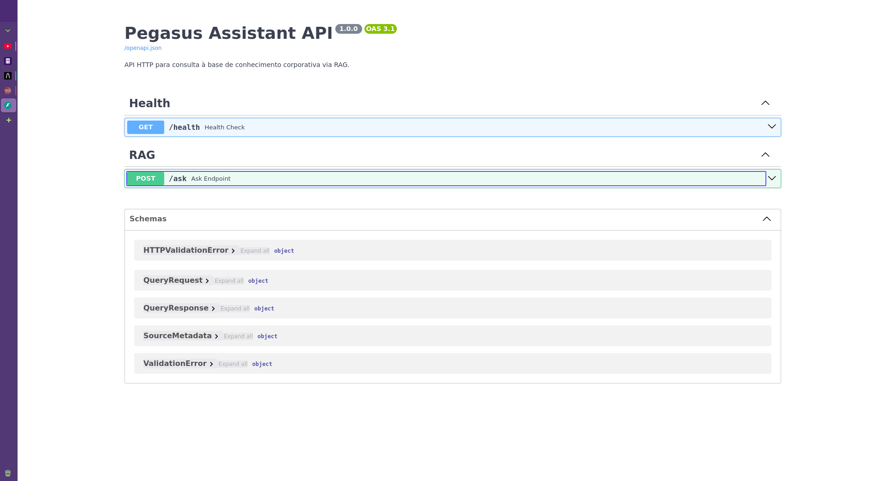
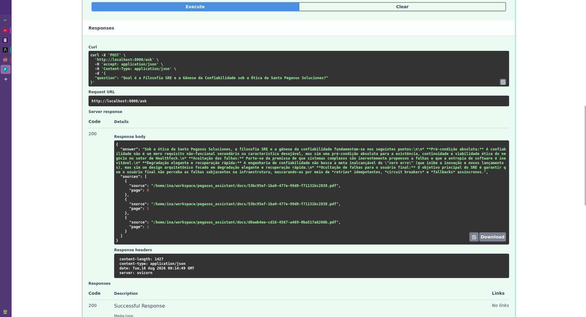
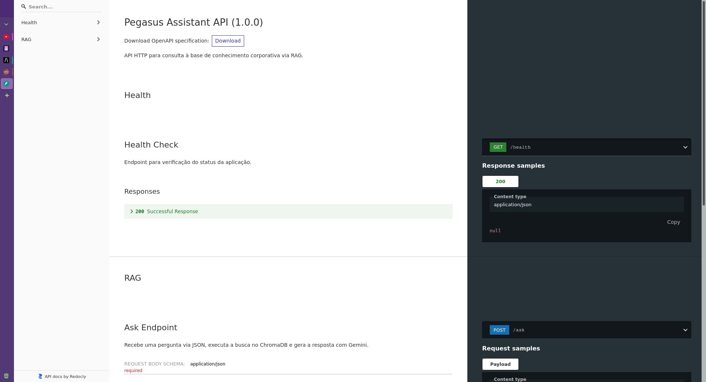

# 🤖 Pegasus Assistant - Agente de IA Corporativo (RAG)

O **Pegasus Assistant** é uma solução de Inteligência Artificial para responder perguntas de colaboradores com base exclusiva em documentos internos da empresa (como políticas, manuais e procedimentos em PDF). 

A aplicação utiliza a arquitetura **RAG (Retrieval-Augmented Generation)**, combinando a precisão da busca vetorial local com a capacidade do **Google Gemini** para gerar respostas contextuais, auditáveis e imunes a alucinações de dados externos.

---

## 🛠️ Tecnologias Utilizadas

* **Sistema Operacional** meu OS de escolha é Debian, utilizo a mais de 10 anos
* **Editor NeoVim** meu editor de escolha é o NeoVim
* **Linguagem:** Python 3.11+
* **Framework de IA:** LangChain (LCEL)
* **Modelo de Linguagem (LLM):** Google Gemini (`gemini-3.6-flash`)
* **Embeddings:** FastEmbed (`sentence-transformers` local e de alta velocidade)
* **Banco de Dados Vetorial:** ChromaDB (`langchain-chroma`)
* **Serviço Web / API:** FastAPI & Uvicorn
* **Conteinerização:** Docker & Docker Compose

---

## 📁 Estrutura do Projeto

```text
/agente_corporativo
├── src/
│   ├── api/             # Endpoints HTTP da API em FastAPI (main.py)
│   ├── core/            # Lógica central da cadeia RAG com LangChain (rag.py)
│   ├── ingestion/       # Pipeline de leitura de PDFs e vetorização (ingest.py)
│   └── scripts/         # Interface de linha de comando CLI (query.py)
├── data/                # Armazenamento persistente da base vetorial ChromaDB
├── documentos/          # Diretório para inserção dos PDFs corporativos
├── .env                 # Variáveis de ambiente e chave da API do Gemini
├── Dockerfile           # Instruções de compilação do container Docker
├── docker-compose.yml   # Orquestração do serviço e volumes
└── requirements.txt     # Dependências do projeto Python
```

## ⚙️ Configuração Inicial

1. Pré-requisitos

* Python 3.11 ou superior instalado.

* Uma chave de API do Google Gemini (obtenha gratuitamente no Google AI Studio).

* (Opcional) Docker e Docker Compose instalados.

2. Variáveis de Ambiente

Crie um arquivo chamado `.env` na raiz do projeto com o seguinte conteúdo:

```text

GOOGLE_API_KEY=sua_chave_api_aqui

```

## 🚀 Execução Local (Sem Docker)

1. Instalar as Dependências

Crie e ative um ambiente virtual Python, e em seguida instale os pacotes:

```Bash

python3 -m venv venv
source venv/bin/activate
pip install -r requirements.txt

```

2. Ingerir Documentos (Alimentar a Base de Dados)

    1. Coloque seus arquivos PDF na pasta `./documentos/`.

    2. Execute o script de ingestão para converter os textos em vetores e armazená-los no ChromaDB:

```Bash

python3 -m src.ingestion.ingest

```

3. Consultar via Terminal (CLI)

Você pode fazer perguntas diretamente pelo terminal para testar a busca:

```Bash

python3 -m src.scripts.query "Qual é a missão da Pegasus Soluciones?"

```

4. Iniciar a API HTTP (FastAPI)

Suba o servidor da API para expor os endpoints HTTP:

```Bash

uvicorn src.api.main:app --reload --host 0.0.0.0 --port 8000

```

Acesse a documentação interativa no navegador:

* Swagger UI: `http://localhost:8000/docs`

* ReDoc: `http://localhost:8000/redoc`

## 🐳 Execução via Docker e Docker Compose

O projeto está totalmente conteinerizado para facilitar o deploy em servidores de produção Linux.

1. Subir o Container

```Bash

docker compose up -d --build

```

2. Rodar a Ingestão no Container

Sempre que adicionar ou alterar PDFs na pasta local ./documentos/, execute o comando de ingestão dentro do container em execução:

```Bash

docker compose exec pegasus-assistant-api python3 -m src.ingestion.ingest

```

3. Fazer Consultas via CLI no Container

```Bash

docker compose exec pegasus-assistant-api python3 -m src.scripts.query "Qual é o prazo para reembolso de despesas?"

```

## 📡 Exemplo de Requisição à API

Endpoint: `POST /ask`

Payload (JSON):

```JSON

{
  "question": "Qual é a política de reembolso da empresa?"
}

```
Exemplo com `curl`:

```Bash

curl -X 'POST' \
  'http://localhost:8000/ask' \
  -H 'Content-Type: application/json' \
  -d '{"question": "Qual é a política de reembolso da empresa?"}'

  ```

  Resposta:

  ```JSON

{
  "answer": "De acordo com os documentos internos, a solicitação de reembolso deve ser enviada em até 5 dias úteis...",
  "sources": [
    {
      "source": "documentos/politica_de_reembolso.pdf",
      "page": 2
    }
  ]
}

```

## Demo do deploy da applicacao







